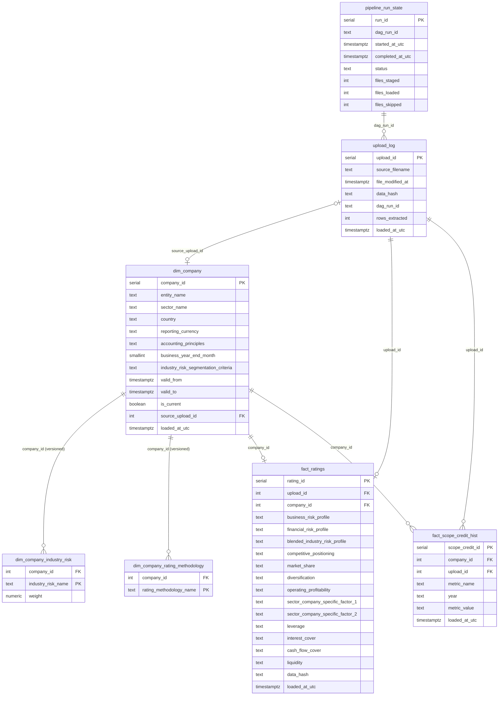

# Corporate Credit Rating Data Pipeline

End-to-end data pipeline for corporate credit rating Excel files. Extracts, validates, transforms, and loads structured rating data into a PostgreSQL star schema, orchestrated with **Apache Airflow** and queryable via a **FastAPI** REST service — all in Docker Compose.

---

## Project structure

```
.
├── airflow/
│   └── Dockerfile                  # Custom Airflow image (pandas + openpyxl + providers)
├── api/
│   ├── Dockerfile                  # FastAPI service image
│   ├── main.py                     # App entry point; wires all routers
│   ├── db.py                       # psycopg2 connection pool
│   ├── models.py                   # Pydantic response models
│   └── routers/
│       ├── companies.py            # GET /companies (list, compare, versions, history)
│       ├── snapshots.py            # GET /snapshots (list, latest, by id)
│       └── uploads.py              # GET /uploads (list, details, stats, file download)
├── corporate_pipeline/
│   ├── extractor.py                # Excel → pandas DataFrame + RawMasterRecord
│   ├── validator.py                # Data quality checks (NOT NULL, regex, value sets)
│   ├── transformer.py              # Normalise, hash, build RatingRecord
│   └── loader.py                   # SCD2 upserts, incremental load, duplicate detection
├── dags/
│   ├── corporate_ratings_dag.py            # Production DAG (manual trigger)
│   └── corporate_ratings_dag_integration.py  # Integration-test variant (separate run history)
├── data/
│   ├── input_files/                # Place .xlsm rating files here
│   └── extracted_sheets/           # Auto-created: one CSV per extracted sheet
├── sql/
│   ├── ddl/
│   │   ├── 1_upload_log.sql
│   │   ├── 2_pipeline_run_state.sql
│   │   ├── 3_dim_company.sql                   # SCD Type 2 (valid_from/valid_to/is_current)
│   │   ├── 4_dim_company_industry_risk.sql      # Bridge: company version ↔ industry risk + weight
│   │   ├── 5_dim_company_rating_methodology.sql # Bridge: company version ↔ methodology
│   │   ├── 6_fact_ratings.sql                  # Rating scores per upload
│   │   └── 7_fact_scope_credit_hist.sql         # Time-series Scope Credit Metrics by year
│   └── init_db.sh                              # Creates airflow + corporate databases on first start
├── tests/
│   ├── conftest.py                 # Shared fixtures + email notification hook
│   ├── unit/
│   │   ├── test_extractor.py       # 57 tests: Excel parsing, key-value extraction
│   │   ├── test_validator.py       # 70 tests: NOT NULL, regex, value-set, coverage checks
│   │   ├── test_transformer.py     # 40 tests: normalisation, SHA-256 hashing
│   │   ├── test_loader.py          # 29 tests: SCD2, incremental load, deduplication, private DB fns
│   │   └── test_api.py             # 31 tests: all API endpoints via TestClient (mocked DB)
│   └── integration/
│       └── test_integration.py     # 61 end-to-end tests: DAG + API (requires full stack)
├── _deliverable_artefacts/
│   ├── API_CALLS_EXAMPLES.md       # 13 API call examples with real responses
│   ├── data_quality_report_example.png
│   ├── airflow_logs/               # Pipeline execution log examples
│   └── ai_usage/
│       ├── AI_USAGE.md             # AI tools disclosure
│       └── chat_transcript.md      # Redacted Claude Code session transcript
├── docker-compose.yml
├── Makefile
└── README.md
```

---

## Prerequisites

### Install Docker

Download Docker Desktop from https://www.docker.com/products/docker-desktop/ and complete first-run setup.

```bash
docker --version            # Docker version 29.x.x
docker compose version      # Docker Compose version v2.x.x
```

---

## Quick start

### 1 — Start everything

**First time / production** — starts all services in the background and returns immediately:

```bash
docker compose up -d
```

Check status manually once started (≈ 60 s on first start):

```bash
docker compose ps   # all should show "healthy" or "exited (0)"
```

**Development (clean restart)** — removes all containers, **wipes all database volumes**, rebuilds images, starts fresh, and **blocks until every service is healthy** before returning:

```bash
make up
```

`make up` runs `docker compose down -v` first, which deletes the `postgres_data` volume — the database is fully empty on each restart. When the command returns, all services are confirmed healthy and the DB schemas have been re-initialised.

Either way, startup order is handled automatically:
1. **postgres** starts and passes its health check
2. **airflow-init** runs once to create the Airflow metadata schema and `admin` user, then exits
3. **airflow-webserver** and **airflow-scheduler** wait for init to complete, then start
4. **api** starts once postgres is healthy

| Service | URL | Credentials |
|---------|-----|-------------|
| Airflow UI | http://localhost:8091 | `admin` / `admin` |
| FastAPI docs | http://localhost:8000/docs | — |
| FastAPI ReDoc | http://localhost:8000/redoc | — |
| PostgreSQL | `localhost:5432` | superuser `postgres` / `postgres` |

---

### 2 — Place input files

Copy your `.xlsm` rating files into `data/input_files/`:

```bash
ls data/input_files/*.xlsm
```

---

### 3 — Verify all services are healthy

```bash
docker compose ps
```

All services should show `healthy` or `exited (0)` before triggering the pipeline. If any service is still starting, wait a few seconds and re-run.

---

### 4 — Trigger the pipeline

**Via the Airflow UI:**
1. Open http://localhost:8091 and log in with `admin` / `admin`
2. Unpause the `corporate_ratings_pipeline` DAG (toggle on the left).
3. Click **Trigger DAG** (play button ▶).

**Via the CLI:**

```bash
docker compose exec airflow-scheduler \
    airflow dags trigger corporate_ratings_pipeline
```

---

### 5 — Monitor execution

```bash
# Live scheduler logs
docker compose logs -f airflow-scheduler

# Task logs are in the Airflow UI:
# DAGs → corporate_ratings_pipeline → <run> → <task> → Logs
```

The DAG has five sequential steps:

```
create_tables >> extract_sheets >> validate_data >> transform_data >> load_to_warehouse
```

| Task | Description |
|------|-------------|
| `create_tables` | Applies all DDL files (`CREATE TABLE IF NOT EXISTS`) |
| `extract_sheets` | Reads each staged `.xlsm`, saves extracted CSV, pushes `RawMasterRecord` list via XCom; file reads use an exponential-backoff retry decorator to handle transient I/O errors |
| `validate_data` | NOT NULL, regex, value-set and weight checks; fails on any CRITICAL error; logs formatted quality report |
| `transform_data` | Normalises fields, computes SHA-256 data hash, produces `RatingRecord` list |
| `load_to_warehouse` | SCD2 upserts to `dim_company`; populates bridge tables, `fact_ratings`, `fact_scope_credit_hist`; skips duplicates with WARNING |

All tasks retry **twice** with **exponential backoff** (base delay 1 min, cap 10 min) before marking failed.

**Incremental loading:** only files modified after the last successful DAG run are staged. If a file is re-uploaded with identical content (hash match), it is skipped with a clear `WARNING` log and the run completes successfully.

---

### 6 — Explore the API

Interactive docs at http://localhost:8000/docs.

**Sample requests:**

```bash
# List current companies
curl http://localhost:8000/companies

# All SCD2 versions for Company A
curl "http://localhost:8000/companies/Company%20A/versions"

# Scope Credit Metrics time-series for Company A
curl "http://localhost:8000/companies/Company%20A/history"

# Latest snapshot per company
curl http://localhost:8000/snapshots/latest

# All snapshots filtered by currency
curl "http://localhost:8000/snapshots?currency=EUR"

# Compare two companies (optionally at a point in time)
curl "http://localhost:8000/companies/compare?entity_names=Company%20A,Company%20B"
curl "http://localhost:8000/companies/compare?entity_names=Company%20A,Company%20B&as_of_date=2099-01-01T00:00:00Z"

# Upload stats
curl http://localhost:8000/uploads/stats

# Details for upload 1 (includes rating snapshot)
curl http://localhost:8000/uploads/1/details
```

Full examples with real response bodies: [`_deliverable_artefacts/API_CALLS_EXAMPLES.md`](_deliverable_artefacts/API_CALLS_EXAMPLES.md)

---

### 7 — Inspect results in PostgreSQL

**Option A — psql (terminal):**

```bash
docker compose exec postgres \
    psql -U corporate -d corporate
```

Tip: run `\x auto` inside psql for automatic expanded display, or pass `-x` and a query directly:

```bash
docker compose exec postgres \
    psql -U corporate -d corporate -x -c "SELECT * FROM pipeline_run_state ORDER BY started_at_utc DESC;"
```

**Option B — VS Code SQLTools extension (optional, recommended for interactive querying):**

1. Install **SQLTools** and **SQLTools PostgreSQL/Cockroach Driver** from the VS Code Extensions panel.
2. Add a new connection with these settings:

| Field | Value |
|---|---|
| Host | `localhost` |
| Port | `5432` |
| Database | `corporate` |
| Username | `corporate` |
| Password | `corporate` |

You then get syntax highlighting, autocomplete, and results in a table view directly in the IDE.

Useful queries:

```sql
-- Pipeline run history
SELECT dag_run_id, status, files_staged, files_loaded, files_skipped, completed_at_utc
FROM pipeline_run_state
ORDER BY started_at_utc DESC;

-- All current companies
SELECT entity_name, sector_name, country, reporting_currency,
       accounting_principles, valid_from
FROM dim_company
WHERE is_current = TRUE
ORDER BY entity_name;

-- Industry risk weights per company (current version)
SELECT dc.entity_name, cir.industry_risk_name, cir.weight
FROM dim_company_industry_risk cir
JOIN dim_company dc ON dc.company_id = cir.company_id AND dc.is_current = TRUE
ORDER BY dc.entity_name, cir.weight DESC;

-- Methodologies applied per company (current version)
SELECT dc.entity_name, crm.rating_methodology_name
FROM dim_company_rating_methodology crm
JOIN dim_company dc ON dc.company_id = crm.company_id AND dc.is_current = TRUE
ORDER BY dc.entity_name;

-- All rating scores
SELECT dc.entity_name, dc.sector_name,
       fr.business_risk_profile, fr.financial_risk_profile,
       fr.leverage, fr.liquidity, fr.loaded_at_utc
FROM fact_ratings fr
JOIN dim_company dc ON dc.company_id = fr.company_id
ORDER BY fr.loaded_at_utc DESC;

-- Time-series Scope Credit Metrics for a company
SELECT dc.entity_name, fsc.metric_name, fsc.year, fsc.metric_value
FROM fact_scope_credit_hist fsc
JOIN dim_company dc ON dc.company_id = fsc.company_id
WHERE dc.entity_name = 'Company A'
ORDER BY fsc.metric_name, fsc.year;

-- SCD2 version history for a company
SELECT entity_name, valid_from, valid_to, is_current
FROM dim_company
WHERE entity_name = 'Company A'
ORDER BY valid_from;

-- Upload log
SELECT source_filename, rows_extracted, data_hash, loaded_at_utc
FROM upload_log
ORDER BY loaded_at_utc DESC;
```

---

## Running tests

### All tests (unit + integration) — single command

No prior `make up` is needed. This command starts all required services from scratch (or reuses running ones), then runs all tests:

```bash
make test
```

Expected output:

```
288 passed in ~40s
```

The command handles everything automatically:
- Builds images if not already built
- Starts postgres, Airflow init, webserver, scheduler, and a test-isolated API instance
- Truncates the `corporate_test` schema before the integration run so tests always start clean
- Tears down the run container when done (long-running services remain up)

Integration tests write to the `corporate_test` schema — the production `public` schema is never touched.

---

### Unit tests only

```bash
make test-unit
```

Expected: `227 passed`

**Coverage report** (terminal + HTML):

```bash
make coverage
```

This runs all unit tests with branch coverage across `corporate_pipeline/` and `api/`:

```
Name                                Stmts   Miss Branch BrPart  Cover
----------------------------------------------------------------------
api/__init__.py                         0      0      0      0 100.0%
api/db.py                              46     35      4      0  22.0%
api/main.py                            19      4      2      0  71.4%
api/models.py                          76      0      0      0 100.0%
api/routers/__init__.py                 0      0      0      0 100.0%
api/routers/companies.py               64      0     10      0 100.0%
api/routers/snapshots.py               55      0     14      0 100.0%
api/routers/uploads.py                 53      0      6      0 100.0%
corporate_pipeline/__init__.py          0      0      0      0 100.0%
corporate_pipeline/extractor.py       174      8     54      9  92.5%
corporate_pipeline/loader.py           95      0     22      0 100.0%
corporate_pipeline/transformer.py      71      0      8      0 100.0%
corporate_pipeline/validator.py        82      2     12      2  95.7%
----------------------------------------------------------------------
TOTAL                                 735     49    132     11  92.4%
```

HTML output is written to `coverage_html/index.html` (open in a browser for line-level detail).

> **`api/db.py` (22%)** — database connection-pool infrastructure; requires a live PostgreSQL instance so it is exercised only by integration tests, not unit tests.
> **`api/main.py` (71%)** — the uncovered lines are the 500-error handler branch that only fires under unhandled exceptions (not reachable with mocked dependencies).

---

### Integration tests only

```bash
make test-integration
```

Expected: `61 passed`

The integration test suite:
1. Truncates the `corporate_test` schema and clears prior DAG runs
2. Triggers the `corporate_ratings_pipeline_integration` DAG (using the test Airflow connection)
3. Polls every 15 s until success (timeout 15 min)
4. Verifies all 5 tasks succeeded and checks every DB table including bridge tables and `fact_scope_credit_hist`
5. Re-triggers and verifies idempotency (`files_loaded=0`)
6. Exercises all `/companies`, `/snapshots`, and `/uploads` API endpoints

---

## Data model

### Conceptual model

The pipeline models a **corporate credit rating workflow** with seven tables in three layers:

**Audit layer** — provenance and pipeline state:
- `upload_log` — one row per processed file; SHA-256 hash enables content-level deduplication
- `pipeline_run_state` — one row per DAG run; tracks staging, loading, and skipping counts for every execution

**Dimension layer** — slowly changing entities:
- `dim_company` (SCD Type 2) — central entity; one row per (company, version); sector, country, and currency are inlined as text attributes (no snowflake joins)
- `dim_company_industry_risk` — bridge: each company *version* is assigned one or more industry risk categories with blending weights
- `dim_company_rating_methodology` — bridge: each company *version* is assessed under one or more rating methodologies; supports N methodologies per company

**Fact layer** — measurements:
- `fact_ratings` — one row per company version; the full set of rating sub-scores from the MASTER sheet (business/financial risk profiles, leverage, liquidity, etc.)
- `fact_scope_credit_hist` — one row per (company version, upload, metric, year); captures the time-series Scope Credit Metrics across historical and estimated years

**Key relationships:**
- `upload_log` → `fact_ratings` : one upload produces one rating record
- `upload_log` → `fact_scope_credit_hist` : one upload produces many metric × year rows
- `dim_company` → `dim_company_industry_risk` : each version has N industry risks (with weights)
- `dim_company` → `dim_company_rating_methodology` : each version assessed under N methodologies
- `dim_company` → `fact_ratings` : a company version links to all its rating records
- `dim_company` → `fact_scope_credit_hist` : a company version links to all its time-series rows

### Logical model (ER diagram)



### Tables

| Table | Grain | Key constraint |
|-------|-------|----------------|
| `upload_log` | 1 row per processed file | `UNIQUE(source_filename, data_hash)` |
| `pipeline_run_state` | 1 row per DAG run | `UNIQUE(dag_run_id)` |
| `dim_company` | 1 row per (entity, version) | `UNIQUE(entity_name, valid_from)` |
| `dim_company_industry_risk` | 1 row per (company version, risk) | `PK(company_id, industry_risk_name)` |
| `dim_company_rating_methodology` | 1 row per (company version, methodology) | `PK(company_id, rating_methodology_name)` |
| `fact_ratings` | 1 row per company version | `UNIQUE(company_id)` |
| `fact_scope_credit_hist` | 1 row per (upload, metric, year) | `UNIQUE(upload_id, metric_name, year)` |

### Indexes

| Index | Type | Purpose |
|---|---|---|
| `idx_dim_company_entity_current` | B-tree `(entity_name, is_current)` | Fast SCD2 current-version lookup by entity name |
| `idx_fact_ratings_company_loaded` | B-tree `(company_id, loaded_at_utc DESC)` | Per-company rating history queries |
| `idx_fact_ratings_loaded_brin` | BRIN `(loaded_at_utc)` | Date-range scans on the append-only fact table; near-zero storage overhead; acts as lightweight range-partition pruning for date-filtered queries |
| `idx_fact_scope_credit_company_metric_year` | B-tree `(company_id, metric_name, year)` | Time-series endpoint: filter by company, order by metric + year |
| `idx_fact_scope_credit_loaded_brin` | BRIN `(loaded_at_utc)` | Same range-pruning benefit as `fact_ratings`; see note on partitioning below |

> **Partitioning strategy at scale**: Both fact tables are designed for `PARTITION BY RANGE (loaded_at_utc)` with annual sub-tables once row counts exceed ~50 M. The BRIN indexes above provide equivalent range-pruning benefits at current data volumes without the operational complexity of partition management. Note that PostgreSQL's global `UNIQUE` constraint cannot span partitions, so the deduplication keys (`UNIQUE(company_id)` and `UNIQUE(upload_id, metric_name, year)`) would need to be enforced per-partition when partitioning is adopted.

### Key design decisions and assumptions

**`entity_name` is globally unique.** The same legal entity name cannot appear in different sectors or countries. This is enforced by `UNIQUE(entity_name, valid_from)` in `dim_company` and drives the SCD2 lookup key.

**Sector, country, and currency are inlined into `dim_company`.** Separate `dim_sector`, `dim_country`, and `dim_currency` tables would add snowflake joins with no analytical benefit at this data volume — these are attributes of a company version, not shared lookups.

**SCD2 triggers on any metadata change.** When any of the following change — sector, country, reporting currency, accounting principles, business year-end month, industry risk segmentation criteria, industry risk assignments or weights, or applied methodologies — a new company version is inserted with a fresh `company_id`; the previous version is closed (`valid_to` set, `is_current=FALSE`).

**Bridge tables are versioned through `company_id`.** Because `dim_company_industry_risk` and `dim_company_rating_methodology` reference `company_id` (a specific SCD2 version), changing a risk weight automatically creates a new company version, preserving the full history of risk assignments and methodology choices.

**`business_risk_profile` and `financial_risk_profile`** are composite rating scores computed by analysts from the sub-scores in the same `fact_ratings` row:
- Business: `blended_industry_risk_profile`, `competitive_positioning`, `market_share`, `diversification`, `operating_profitability`, `sector_company_specific_factor_1/2`
- Financial: `leverage`, `interest_cover`, `cash_flow_cover`, `liquidity`

**`fact_scope_credit_hist`** stores the time-series financial data from the [Scope Credit Metrics] Excel section. Each metric × year × upload is one row. `metric_value` is TEXT to accommodate numeric values, estimated periods like `"2025E"`, and qualitative entries like `"adequate"` (Liquidity).

---

## Incremental loading and deduplication

- **File-level incremental**: `stage_modified_files` compares each file's `mtime` against the last successful run timestamp from `pipeline_run_state`. Files not modified since the last run are skipped entirely.
- **Content-level deduplication**: a SHA-256 hash of all business fields (excluding filename and mtime) is computed at transform time. Before inserting, `hash_already_loaded` queries `upload_log`. If the hash exists, the file is skipped with a `WARNING` log and the run exits successfully — no duplicate rows are ever written.

---

## Email notifications

Notifications are disabled by default. Set `ALERT_EMAIL` to enable them.

All SMTP settings live in `docker-compose.yml` under `x-airflow-common`:

```yaml
AIRFLOW__SMTP__SMTP_HOST: "smtp.gmail.com"
AIRFLOW__SMTP__SMTP_PORT: "587"
AIRFLOW__SMTP__SMTP_STARTTLS: "true"
AIRFLOW__SMTP__SMTP_USER: "you@gmail.com"
AIRFLOW__SMTP__SMTP_PASSWORD: "your-app-password"
AIRFLOW__SMTP__SMTP_MAIL_FROM: "you@gmail.com"
ALERT_EMAIL: "alerts@yourteam.com"    # set "" to disable
```

| Event | Mechanism |
|-------|-----------|
| Any Airflow task fails (after retries) | Airflow built-in `email_on_failure` |
| Any unit or integration test fails | `pytest_sessionfinish` hook in `tests/conftest.py` |

> **Security:** avoid committing real SMTP credentials. Use a `.env` file (add to `.gitignore`) or a secrets manager in production.

---

## Environment variables reference

| Variable | Default | Description |
|----------|---------|-------------|
| `INPUT_FILES_DIR` | `/opt/airflow/data/input_files` | Directory scanned for `.xlsm` files |
| `EXTRACTED_SHEETS_DIR` | `/opt/airflow/data/extracted_sheets` | Output directory for extracted CSVs |
| `POSTGRES_HOST` | `postgres` | PostgreSQL hostname |
| `POSTGRES_PORT` | `5432` | PostgreSQL port |
| `POSTGRES_DB` | `corporate` | Corporate database name |
| `POSTGRES_USER` | `corporate` | Database user |
| `POSTGRES_PASSWORD` | `corporate` | Database password |
| `ALERT_EMAIL` | `""` | Failure alert recipient; empty = disabled |

---

## Tear down

```bash
# Stop containers (keeps data)
docker compose down

# Stop and remove everything including volumes
make down
```

---

## Deliverables

| Artefact | Location |
|---|---|
| 13 API call examples with real responses | [`_deliverable_artefacts/API_CALLS_EXAMPLES.md`](_deliverable_artefacts/API_CALLS_EXAMPLES.md) |
| Data quality report example | [`_deliverable_artefacts/data_quality_report_example.png`](_deliverable_artefacts/data_quality_report_example.png) |
| Pipeline execution logs | [`_deliverable_artefacts/airflow_logs/`](_deliverable_artefacts/airflow_logs/) |
| AI tools disclosure | [`_deliverable_artefacts/ai_usage/AI_USAGE.md`](_deliverable_artefacts/ai_usage/AI_USAGE.md) |
| Redacted AI chat transcript | [`_deliverable_artefacts/ai_usage/chat_transcript.md`](_deliverable_artefacts/ai_usage/chat_transcript.md) |

### Save pipeline logs (optional)

To export the full Airflow log history from the Docker volume to your local disk:

```bash
docker run --rm \
  -v scope-data-engineer-offline-assessment_airflow_logs:/logs:ro \
  -v "$(pwd)/logs":/out \
  busybox sh -c "cp -r /logs/. /out/"
```

This creates a `logs/` directory with one file per task instance, organised as `logs/dag_id/task_id/run_id/attempt.log`.
